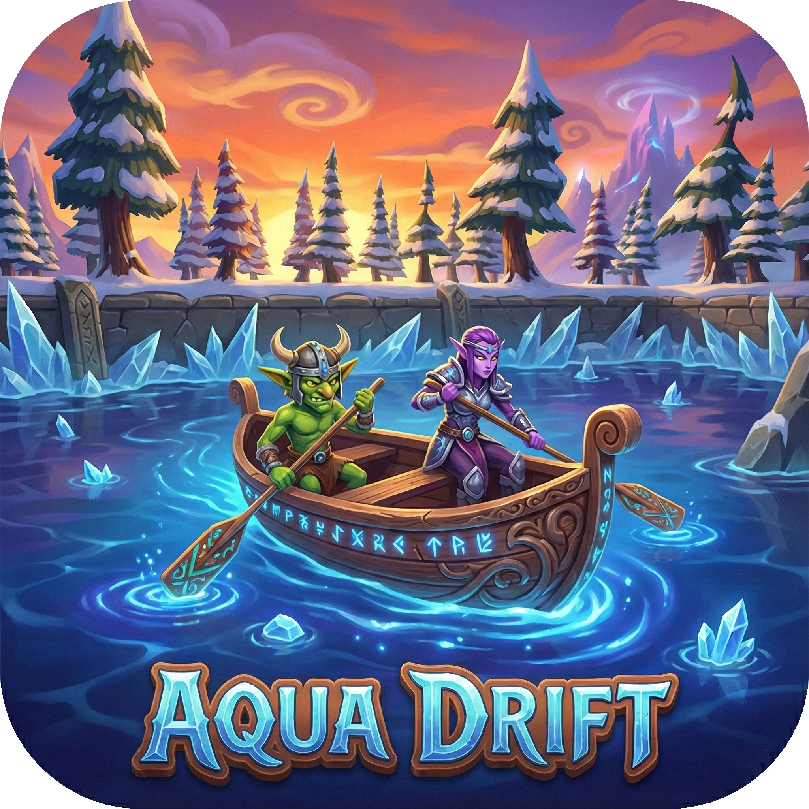

# Aqua Drift



Projekt zaliczeniowy z przedmiotu **Projektowanie gier w środowisku UNITY**  
**Semestr zimowy 2025/2026**

Gra zręcznościowa, w której sterujesz kajakiem, naprzemiennie wiosłując klawiszami **A** i **D**.  
Inspiracją była gra **[Paddle Paddle Paddle](https://store.steampowered.com/app/2320980/Paddle_Paddle_Paddle/)**.

---

## O grze

Przepłyń trasę kajakiem, omijając przeszkody i zbierając boosty.  
Tempo utrzymujesz rytmicznym wiosłowaniem — bez ciągłego trzymania klawiszy, tylko krótkie uderzenia wiosłem.

**Główne elementy:**
- sterowanie kajakiem przez naprzemienne wiosłowanie (A / D)
- kilka poziomów z checkpointami
- przeszkody (m.in. kolce) i boosty
- timer oraz ekran końcowy z wynikiem
- menu pauzy (Esc), muzyka i regulacja głośności

---

## Sterowanie

| Klawisz | Akcja |
|--------|--------|
| **A** | Wiosło lewe (obrót + przyspieszenie) |
| **D** | Wiosło prawe (obrót + przyspieszenie) |
| **Esc** | Pauza / wznowienie |

---

## Sceny

| Scena | Opis |
|-------|------|
| `Assets/Scenes/Scene1.unity` | Poziom 1 |
| `Assets/Scenes/Scene2.unity` | Poziom / menu (scena startowa w Build Settings) |
| `Assets/Scenes/Scene3.unity` | Poziom 3 |
| `Assets/Scenes/SceneEnd.unity` | Ekran końca gry |
| `Assets/Scenes/Credits.unity` | Credits |

---

## Wymagania

- **Unity 6** — wersja edytora: `6000.2.6f2` (lub kompatybilna z Unity 6)
- Render Pipeline: **URP**
- Input System (nowy)
- **[Git LFS](https://git-lfs.com/)** — duża scena (`Scene1`) i pliki audio są trzymane przez LFS

---

## Jak uruchomić projekt

1. Zainstaluj [Unity Hub](https://unity.com/download) i Unity **6000.2.6f2** (lub nowszą Unity 6).
2. Zainstaluj Git LFS (`git lfs install`), potem sklonuj repozytorium:
   ```bash
   git lfs install
   git clone https://github.com/DawidKaczy/Aqua-Drift.git
   ```
3. W Unity Hub → **Open** → wybierz folder projektu.
4. Otwórz scenę z `Assets/Scenes/` i wciśnij **Play**.

> Folder `Library/` nie jest w repozytorium — Unity wygeneruje go przy pierwszym otwarciu projektu.

---

## Struktura projektu

```
Assets/
├── Scenes/          # sceny gry
├── Scrips/          # skrypty C# (logika gry)
├── Postac/          # animacje postaci / wiosłowanie
├── Sound/           # audio
├── Settings/        # ustawienia URP / projektu
├── Kolory/          # materiały / kolory
└── aqua_drift.png   # grafika / branding gry
```

Wybrane skrypty:
- `PlayerController.cs` — ruch kajaka i wiosłowanie
- `MenuController.cs` — pauza
- `checkpoint.cs`, `playerREspown.cs` — checkpointy i respawn
- `Timer.cs`, `TimerEnd.cs`, `EndScreen.cs` — czas i koniec gry
- `Boost.cs`, `KolceV1.cs`, `KolceV2.cs` — boosty i przeszkody
- `MusicMenager.cs`, `VolumeController.cs` — audio

---

## Build

Gotowy build Windows znajduje się lokalnie w folderze `xBuildGierka` (poza tym repozytorium).  
W Unity: **File → Build Settings → Build**.

---

## Autor

Projekt studencki — przedmiot *Projektowanie gier w środowisku UNITY*, semestr zimowy 2025/2026.

Inspiracja: *Paddle Paddle Paddle*.
